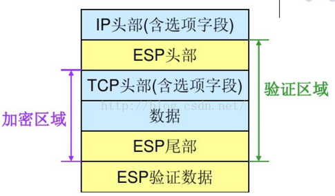

# ipsec 在传输模式下esp报文的拆包和装包

## ipsec传输模式
不同于隧道模式，传输模式的ipsec相当于是需要对于ip数据包先做一个解析分离出iphead和对应的ip报文也就是payload，然后对于payload通过首先上商定过的sa进行加密和摘要保证，之后再把进行包装过的报文重新和之前解析出的header（需要把协议号改成50：esp，或者51：ah）合并在一起之后再发送。

## 装包过程

1. append the ESP trailer
2. Encryption
3. Append and ESP header
4. Append MAC
5. change the IP header

其中尾部所覆盖的加密部分如图有三部分，其中验证部分也就是摘要涵盖了4个部分。

具体而言就是
1. 在原IP报文末尾添加ESP trailer 信息
其中包含三个部分，因为sa所确定的加密算法可能是块加密，所以如果最后一块长度不足就需要填充，并且在填充之后再附上总共填充的长度方便之后拆包的时候能够非常快速把填充部分去掉。最后一部分是next header，用来表明这一个被加密的报文的类型，比如6=tcp，udp之类的ip层上一层的协议。

2. 之后将原ip报文以及第一步得到的esp trailer作为一个整体来进行加密封装，具体的加密算法和密钥由之前协商好的sa来确定。

3. 为得到的加密数据添加esp header，esp header有spi和sep#两部分组成。加密数据和esp header合称为enchilada，构成认成的组成部分。其中，32位的SPI与目的地址和协议组成的三元组可以为IP包确定唯一的SA，序列号可用于抗重放攻击。

4. 附加完整性度量结果，对第三部得到的enchilada部分做认证，得到一个32位整数倍的mac，附着在esp报文的尾部。同样对应的摘要算法还是由对应的sa给出。

5. 最后是把之前解析出的ip header重新附着在esp报文前，随后， IP头的协议字段填的是50。除了头插入位置不同之外， IPv6处理规则基本上类似于IPv4。 ESP头可插在任意一个扩展头（在路由过程中，有可能被修改）之后。

## 拆包过程

1. 接受方收到ip报文后，发现协议类型是50，表明是一个esp包，首先查看ESP header，通过spi决定数据报文对应的sa，从而知道对应的是transport模式。

2. 计算enchilada部分的摘要，与附在末尾的icv做对比，验证数据的完整性。

3. 在知道消息已经未被修改后，检查seq#顺序号，防止重放攻击。

4. 根据 SA 所指定的加密算法和密钥，解密密文段，得到原来的 TCP 报文和 ESP trailer。

5. 根据 ESP trailer 的填充长度信息，找出填充字段的长度，删除填充字段得到原来的传输层报文（ip报文payload）

6. 根据传输层header信息将报文交付给传输层。